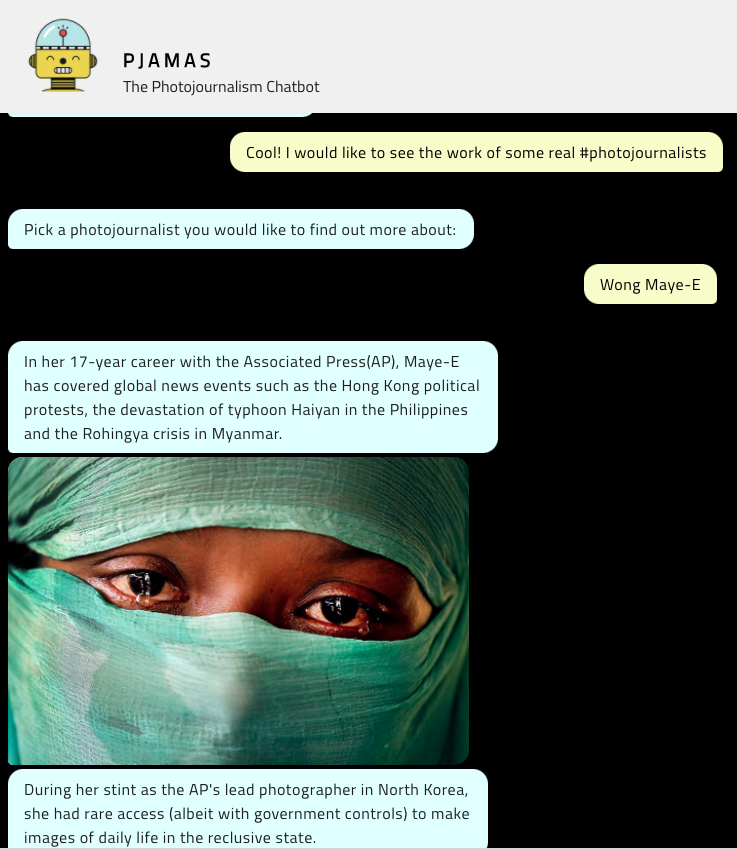
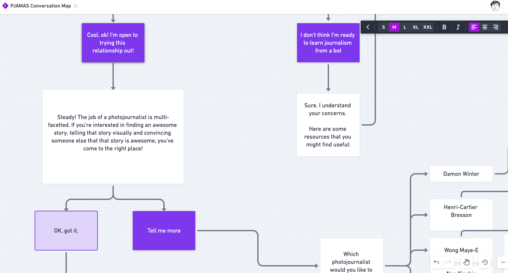

</img> 
 

# `PJ.A.M.A.S.`  `the photojournalism chatbot`

`PJAMAS is a chatbot that helps photojournalism students tell better stories!`

---

## `WHY PJ.A.M.A.S. ?`
PJ.A.M.A.S., or Photojournalism Assistance Made Available and Simple, is a chatbot borned out of a need to ~~automate the answering of repeated questions from my students~~ create a central portal for budding photojournalists to seek basic help for their photojournalism assignments. 
The chatbot is designed for short conversations(not more than 10 minutes should be spent on a conversation). If succinct answers can't be found on PY.J.A.M.A.S., a hyperlink to a blogpost, website will be provided. 

Try out the chatbot at this [link](https://pjamas-app.glitch.me/).

## `UNDER THE PJ.A.M.A.S. !`
We go under the hood to explore the different thought processes behind the P
</img>

>**Overcoming the limits of the medium** - One of the limitations in using a chatbot for mentoring is the user possibly viewing the bot as an inferior substitute to a physical mentor. One of the potential solutions to this is reduce uncited text statements, but whenever possible -- refer users to the work of respected photographers that they can learn from. 

</img>
>**Conversation-Mapping** - I used a tool called Whimsical to plan a map of the different conversations that will take place in our chatbot. 

## `TEAM PJ.A.M.A.S. THANKS _________ !`
PYJAMAS was built on Glitch with the patient mentorship of [Charlotte Webb](https://oeb.global/programme/speakers/oeb-17/charlotte-webb)(Feminist Internet) and [Alex Fefegha](https://www.comuzi.xyz/index.html)(Comuzi).

